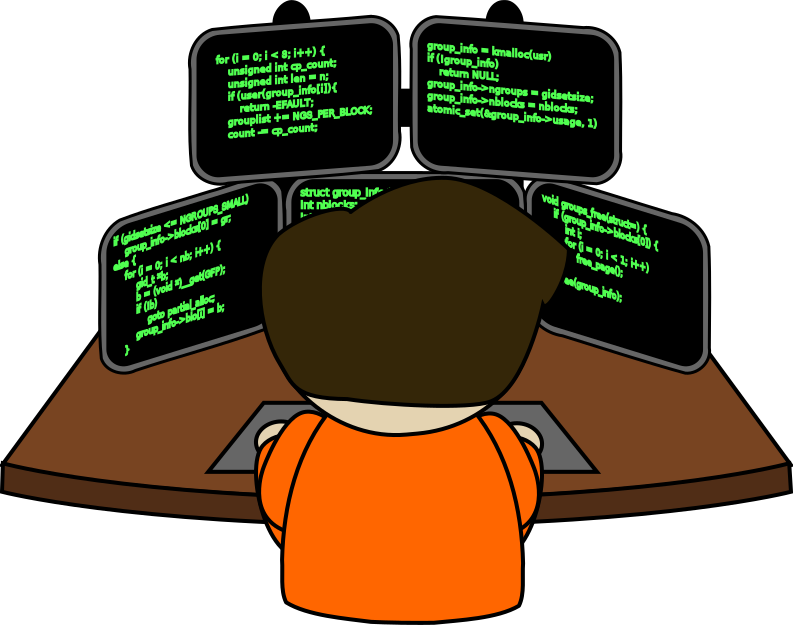

# MY PORTFOLIO

A portfolio website I created

## Author

Dewald Fourie

## Tech Stack

**Client:** HTML, CSS, Vanilla JavaSCript

## Tools Used

Below are are list of tools used, and the precise things they were used for:

- [Ion Icons](https://ionic.io/ionicons) for hambuger menu bar
- [Drawkit](https://www.drawkit.io/) for illustration
- [Icon8](https://icons8.com/) for animated icons and skills icons
- [Animate CSS](https://animate.style/) for bio text animation
- [Formspree](https://formspree.io/) for contact form submision and straight delivery to Gmail

## Folder Structure

The index.html and readme files are in the root folder, alongside the screenshot included in the readme.

The assets folder contains the CSS and JavaScript files, all images and icons used, in their respective folders.

## Customization Guide

I used Ion Icons and Icons8 for the icons

For the form submission, formspree was used.

## Acknowledgements

- [Awesome Readme Templates](https://awesomeopensource.com/project/elangosundar/awesome-README-templates)
- [Awesome README](https://github.com/matiassingers/awesome-readme)
- [How to write a Good readme](https://bulldogjob.com/news/449-how-to-write-a-good-readme-for-your-github-project)
